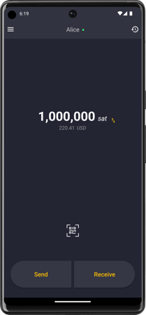

# BitBanana

⚡️ Superpowers for you and your bitcoin lightning node! Use and manage your node wherever you are. ⚡️

BitBanana is a native android app for node operators focused on user experience and ease of use.
While it is not a wallet on its own, BitBanana works like a remote control allowing you to use your node as a wallet wherever you go.  
The app is designed with an educational approach, providing the user with guidance on every aspect of node operation.

BitBanana forked from Zap Android. You can find more information about this on the [Rebranding](docs/REBRANDING.md) page.

## Getting started

The easiest way to get started is using [Start9](https://start9.com/) or [Umbrel](https://getumbrel.com/) to run LND or Core Lightning on a raspberry pi and then connect BitBanana to that node.
There are of course a lot more possible ways to run a node, so please refer to the [setup](https://github.com/michaelWuensch/BitBanana/wiki/Setup) section in the Wiki if you need help to get started.

Or download the latest APK from the [Releases Section](https://github.com/michaelWuensch/BitBanana/releases/latest).

## Features
**General**
- [x] Connect to remote lightning nodes (LND & Core Lightning)
- [x] Available in many languages
- [x] Explanations and help across the app
- [x] Convenient VPN automation
- [x] And of course, BitBanana is Bitcoin only!

**Node Management**
- [x] Use your node as a lightning wallet wherever you are
- [x] Manage multiple nodes
- [x] Manage peers
- [x] Manage channels
- [x] Manage routing fees
- [x] Routing summary

**Wallet**
- [x] 100% free. The only fees you pay are to the bitcoin network. BitBanana won't charge you a single sat.
- [x] Send & receive on-chain and off-chain
- [x] Contacts (with [Avatars](https://github.com/michaelWuensch/avathor-rfc#avathor))
- [x] Send funds to lightning addresses (email like addresses)
- [x] Send funds without an invoice (keysend)
- [x] NFC support
- [x] Transaction filters
- [x] BTC, mBTC, bit & Satoshi units
- [x] Fiat currency prices
- [x] Support for SegWit & Taproot
- [x] Sign/Verify
- [x] LNURL support (pay, withdraw, auth, channel)

**Security & Privacy**
- [x] 100% Self-custodial
- [x] 100% open source code with [reproducible](docs/REPRODUCE.md) releases
- [x] ZERO data collection
- [x] Tor support
- [x] PIN protected access
- [x] Scrambled PIN by default
- [x] Stealth mode (hide app)
- [x] Hide balances
- [x] User guardian system (BitBanana warns you when you are about to perform a potentially dangerous or privacy leaking action)
- [x] Supports self-hosted block explorers
- [x] Supports self-hosted exchange rate providers
- [x] Supports self-hosted fee estimation providers
- [x] Protection against screen recording

## Security

If you discover or learn about a potential error, weakness, or threat that can compromise the security of BitBanana, we ask you to keep it confidential and [submit your concern directly to the BitBanana developer](mailto:bitbananasecurity@proton.me?subject=[GitHub]%20BitBanana%20Security).

## Self-custodial

BitBanana is fully self-custodial. When using the app there is absolutely no interaction with any BitBanana team or service. We do not even know you are using our app.

## Get Help

If you are having problems with BitBanana, please report the issue in [GitHub][issues] or on [discord][discord] with screenshots and/or how to reproduce the bug/error.

## Contribute

Hey! Do you like BitBanana? Awesome! We could actually really use your help!

Open source isn't just writing code. You can help BitBanana with any of the following:

- [Donate](https://bitbanana.app/donate)
- Drop a star on github
- Share a positive review and rate the app in the [app store](https://play.google.com/store/apps/details?id=app.michaelwuensch.bitbanana)
- Tell your friends about it
- [Translate](docs/TRANSLATING.md) the app using Weblate
- Find and report bugs, [Open an issue][issues]
- Suggest new features
- Provide support to fellow users on BitBanana's [discord][discord]
- Contribute to our documentation
- Review pull requests
- Fix bugs, implement new features

If you would like to contribute to the project code, please see the [Contributing Guide](docs/CONTRIBUTING.md)

If you want to setup a testing environment, please see the [Regtest Guide](docs/REGTEST.md)

## Build

If you want to build the app yourself take a look at the [Installation Guide](docs/INSTALL.md)

## Verify/Reproduce

BitBanana is reproducible.  
You want to verify that the app distributed in the app store is actually built from the source available here on github?  
See these [reproduce](docs/REPRODUCE.md) instructions.

## Maintainers
- [Michael Wünsch](https://github.com/michaelWuensch)

## License

This project is open source under the MIT license, which means you have full access to the source code and can modify it to fit your own needs. See [LICENSE](LICENSE) for more information.

[MIT](LICENSE) © Jack Mallers, Michael Wuensch

[issues]: https://github.com/michaelWuensch/BitBanana/issues
[discord]: https://discord.gg/Xg85BuTc9A
