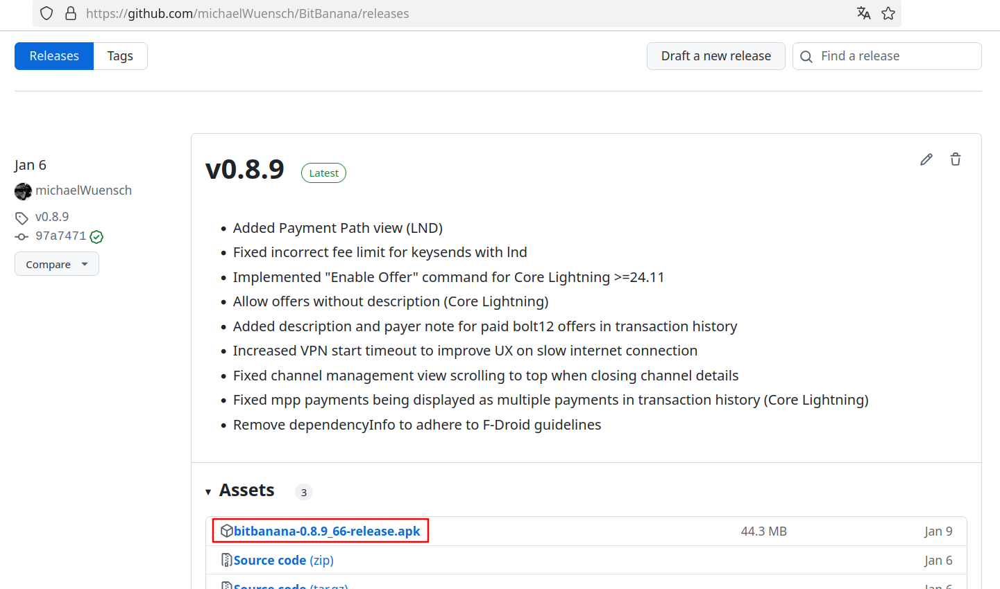
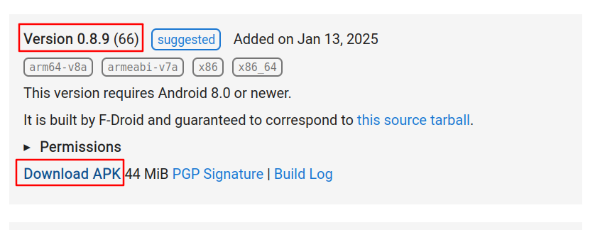

# Reproduce

## Verify GitHub and F-Droid releases
The GitHub release and the F-Droid release are verified the same way. The only difference is where you download the original app.

### Prerequisites: 
Before you begin, ensure you have the following installed:
- `git` ([link](https://git-scm.com/))
- `docker` ([link](https://www.docker.com/))

### 1. Download release and confirm which version you want to verify
Verifying the GitHub and F-Droid releases involves the same steps—the only variation is where you obtain the app.

**Github:**

Download the release from [GitHub][githubrelease].



In the above example, the app version is 0.8.9 with build number 66.

**F-Droid:**

Download the release from [F-Droid][fdroidrelease].  
Scroll down until you find the boxes for the different versions.


In the above example, the app version is 0.8.9 with build number 66.

### 2. Get the source code
Open Terminal, run the commands:
``` bash
git clone https://github.com/michaelWuensch/BitBanana $HOME/bitbanana
cd $HOME/bitbanana
git checkout v{VERSION FROM STEP 1}

# For our example, the checkout command would be:
git checkout v0.8.9
```

### 3. Build the Docker image

Now we can switch to the reproducible-builds directory and build the Docker image that we'll use to build BitBanana in a reproducible manner. Building the Docker image might take a while depending on your network connection.
``` bash
# Move into the right directory
cd $HOME/bitbanana/reproducible-builds

# Build the Docker image
docker build --platform linux/amd64 -t bitbanana-build-env .
```

### 4. Build the app

Now we are ready to start building the BitBanana Android apk.

``` bash
# Move back to the root of the repository
cd ..

# Build the app
docker run --rm -v "$(pwd)":/app-src --device /dev/fuse --cap-add SYS_ADMIN bitbanana-build-env bash -c "mkdir /app; disorderfs --sort-dirents=yes --reverse-dirents=no /app-src/ /app/; cd /app && gradle clean assembleRelease"
```

After that's done, you have your apk! It's located in:

``` bash
$HOME/bitbanana/app/build/outputs/apk/release/bitbanana-{VERSION FROM STEP 1}_{BUILD NUMBER FROM STEP 1}-release-unsigned.apk
```


### 5. Compare the output
Extract both, the just built apk and the downloaded release apk from step 1.
Rename the folder of the built apk to "built", the other one to "official".

Then run the following command:

``` bash
diff --brief --recursive built/ official/
```

If this command lists any files, this means that some of the files are not identical which in turn means the build cannot be verified. If it does not list any differences, the build is verified!


[githubrelease]: https://github.com/michaelWuensch/BitBanana/releases
[fdroidrelease]: https://f-droid.org/packages/app.michaelwuensch.bitbanana/
