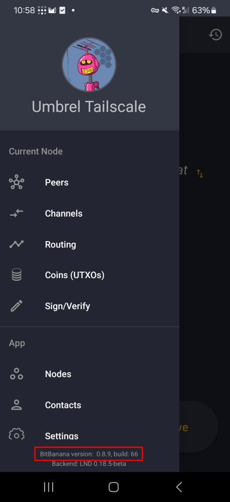

# Reproduce

## Verify Play Store release
Verifying a Play Store release unfortunatelly got way more complicated since Google enforces usage of Android App Bundles (AAB).  

### Prerequisites: 
Before you begin, ensure you have the following installed:
- `git` ([link](https://git-scm.com/))
- `docker` ([link](https://www.docker.com/))
- `python` (version 3.x)
- `adb` ([link](https://developer.android.com/tools/adb))
- `bundletool` ([link](https://github.com/google/bundletool/releases))
- `apktool` ([link](https://apktool.org/))

### 1. Confirm which version you have installed on your Android device
In BitBanana bring up the main menu. You should see the app version at the bottom:



In the above example, the app version is 0.8.9 with build number 66. 

### 2. Get the source code
Open Terminal, run the commands:
``` bash
git clone https://github.com/michaelWuensch/BitBanana $HOME/bitbanana
cd $HOME/bitbanana
git checkout v{VERSION FROM STEP 1}

# For our example, the checkout command would be:
git checkout v0.8.9
```

### 3. Build the Docker image

Now we can switch to the reproducible-builds directory and build the Docker image that we'll use to build BitBanana in a reproducible manner. Building the Docker image might take a while depending on your network connection.
``` bash
# Move into the right directory
cd reproducible-builds

# Build the Docker image
docker build --platform linux/amd64 -t bitbanana-build-env .
```


### 4. Build the app

Now we are ready to start building the BitBanana Android app bundle.

``` bash
# Move back to the root of the repository
cd ..

# Build the app
docker run --rm -v "$(pwd)":/app-src --device /dev/fuse --cap-add SYS_ADMIN bitbanana-build-env bash -c "mkdir /app; disorderfs --sort-dirents=yes --reverse-dirents=no /app-src/ /app/; cd /app && gradle clean bundleRelease"
```

After that's done, you have your app bundle! It's located in:

`./app/build/outputs/bundle/release/bitbanana-{VERSION FROM STEP 1}-release.aab`

### 5. Create device specific apk set

The AAB file is used to create device specific APK files.
When you download the app from Google Play, google is dynamically providing an APK set that fits your phone. This reduces the download file size, as only the necessary files for your phone are included, but it makes reproducibility more complicated. 
To be able to verify the Google Play download we need to extract the same device specific APK from the AAB we just created.  
To do so, we need the [bundletool][bundletool].  


Now let's use bundletool to generate the set of APKs that should be installed on your device.

**While your Android device is connected** to your computer, run the following command to generate the APKs for that device:

``` bash
# Let's create a directory to generate the APKs in
mkdir -p ./reproducible-builds/apks/built-apks

# Generate a set of APKs in an output directory
bundletool build-apks --bundle=./app/build/outputs/bundle/release/bitbanana-{VERSION FROM STEP 1}-release.aab --output-format=DIRECTORY --output=./reproducible-builds/apks/built-apks --connected-device
```

After that the directory `$HOME/bitbanana/reproducible-builds/apks/built-apks` should now look something like this:
```
apks/built-apks/
├── splits
│   ├── base-arm64_v8a.apk
│   ├── base-master.apk
│   └── base-xxhdpi.apk
└── toc.pb
```
> Note: The filenames in the example above that include arm64-v8a and xxhdpi may be different depending on your device. This is because the APKs contain code that's specific to your device's CPU architecture and screen density, and the files are named accordingly.

### 6. Pulling the PlayStore APKs from your device
With your Android device connected to your computer, run the following commands to pull BitBanana APK files and store them in the `$HOME/bitbanana/apks/playstore-apks` directory:

``` bash
# Create the direcotry to store the apk files
mkdir -p ./reproducible-builds/apks/playstore-apks/

# Pull the APKs from the device
adb shell pm path app.michaelwuensch.bitbanana | sed 's/package://' | xargs -I{} adb pull {} ./reproducible-builds/apks/playstore-apks/
```

If everything went well, your directory structure should now look something like this:
```
apks/
├── built-apks
│   ├── splits
│   │   ├── base-arm64_v8a.apk
│   │   ├── base-master.apk
│   │   └── base-xxhdpi.apk
│   └── toc.pb
└── playstore-apks
    ├── base.apk
    ├── split_config.arm64_v8a.apk
    └── split_config.xxhdpi.apk
```

You'll notice that the names of the APKs in each directory are very similar, but they aren't exactly the same. This is because bundletool and Android have slightly different naming conventions.

### 7. Prepare the output for comparison

In order to make the output comparable we need to adjust the names and extract the files, which is tedious.
To simplify this tasks we provide a script.

``` bash
# Move into reproducible-builds folder
cd ./reproducible-builds

# Execute python script to format output
python3 MakeComparable.py --decompile
```

> What the script does:
> 
> - Copies reproducible-builds/apks/ to reproducible-builds/extracted_apks/ 
> 
> In this new directory the following changes are applied: 
> - Moves all .apk files from built-apks/splits to built-apks
> - Deletes now empt built-apks/splits folder
> - Deletes built-apks/toc.pb
> - Renames built-apks/base-master.apk to base.apk
> - Renames the other two apks in built-apks/ by replacing "base" with "split_config".
> - Extracts all apks in built-apks/ and playstore-apks/ and deletes the original apk files after extracting them

### 8. Verifiying the build

We now have two folders that can be compared using various diff tools.

As some diffs are expected, we provide a script that diffs the folders ignoring the expected diffs.

``` bash
# Execute python script to diff output
python3 Diff.py 
```

The script ignores the following expected diffs:
``` bash
IGNORE_LIST = [ "META-INF",
        "stamp-cert-sha256",
        "unknown",
        "AndroidManifest.xml",
        "apktool.yml"]
```

If the script does not show and differences, the build is verified!

If you don't trust the AndroidManifest.xml diffs, look them up. The playstore version should have exactly these 3 lines added, not more:
``` bash
<meta-data android:name="com.android.stamp.source" android:value="https://play.google.com/store"/>
<meta-data android:name="com.android.stamp.type" android:value="STAMP_TYPE_DISTRIBUTION_APK"/>
<meta-data android:name="com.android.vending.derived.apk.id" android:value="3"/>
```


## Alternative methods for diffing the results:

Instead of decompiling the apks with apktool, they can also be simply unzipped. If you want to go that route, just execute the following in step 7, omitting the --decompile option


``` bash
# Execute python script to format output
python3 MakeComparable.py
```
The results can be compared with:
``` bash
diff --brief --recursive extracted_apks/built-apks/ extracted_apks/playstore-apks/
```
> Note: When doing it like this there will be differences in resources.arsc. I don't know why and I can't get rid of it. But as soon as you actually decompile the resources.arsc file the decompiled results are identical again.

Expected differences because the official built is signed:
- META-INF/BNDLTOOL.RSA
- META-INF/BNDLTOOL.SF
- META-INF/MANIFEST.MF
- stamp-cert-sha256
- AndroidManifest.xml

And unfortunatelly:
- resources.arsc

[bundletool]: https://github.com/google/bundletool
